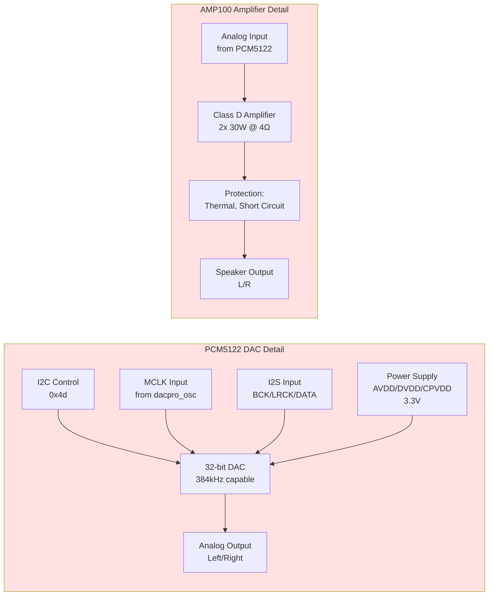
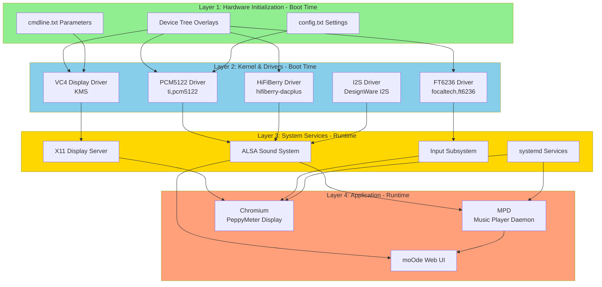
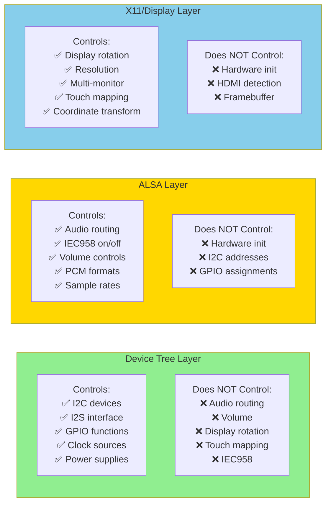
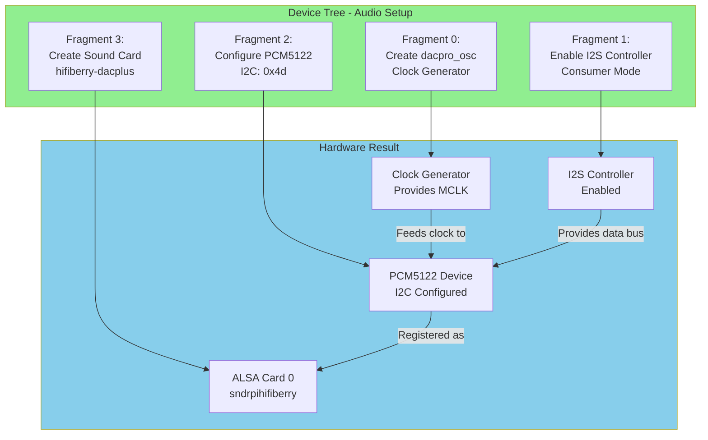
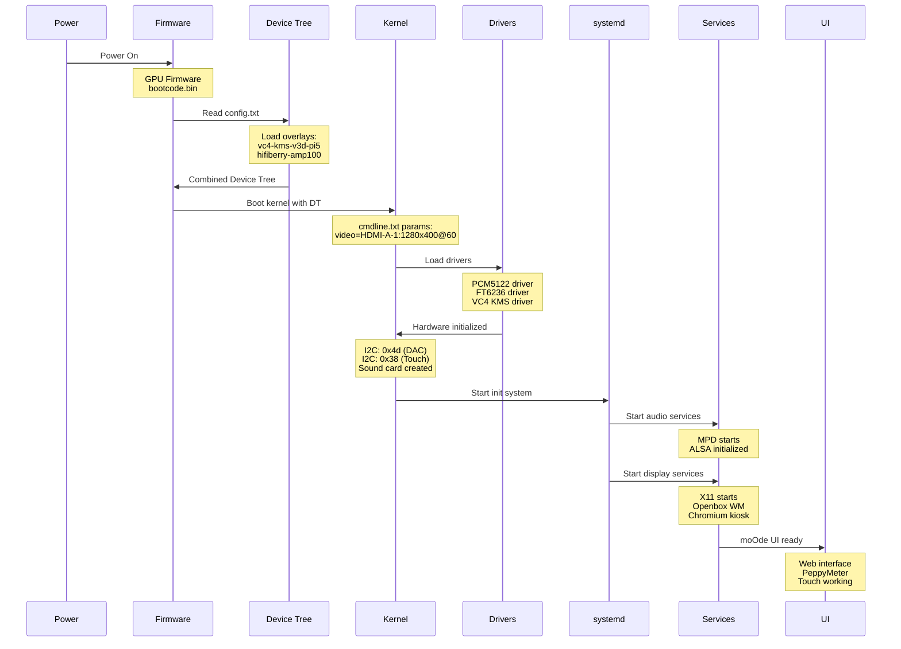
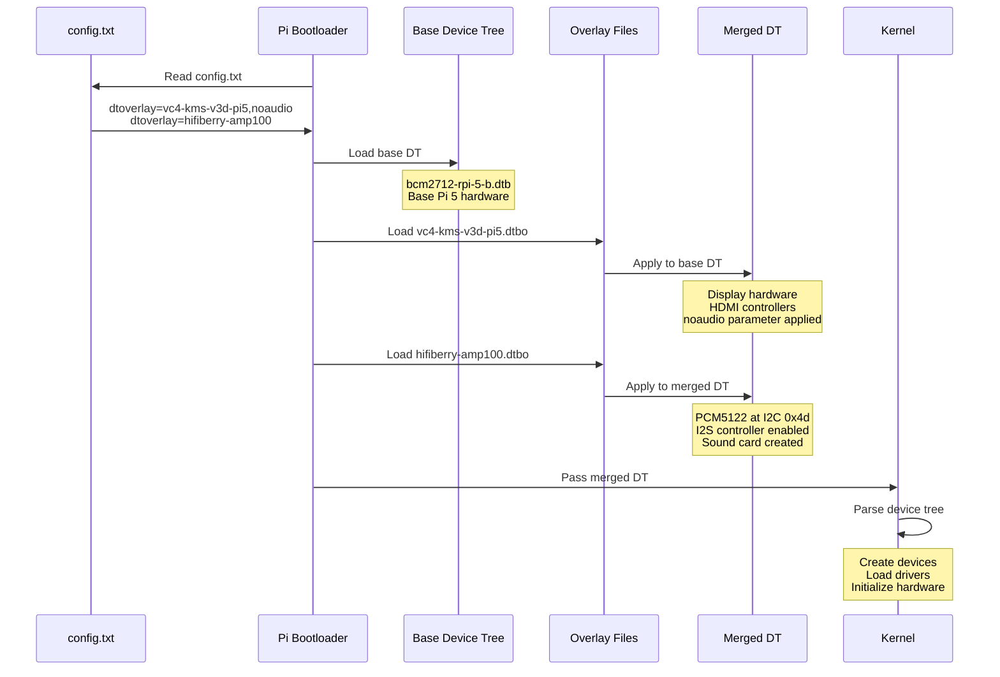
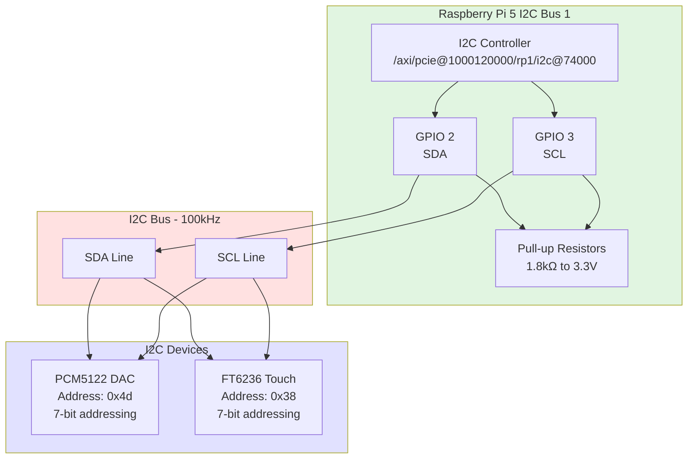
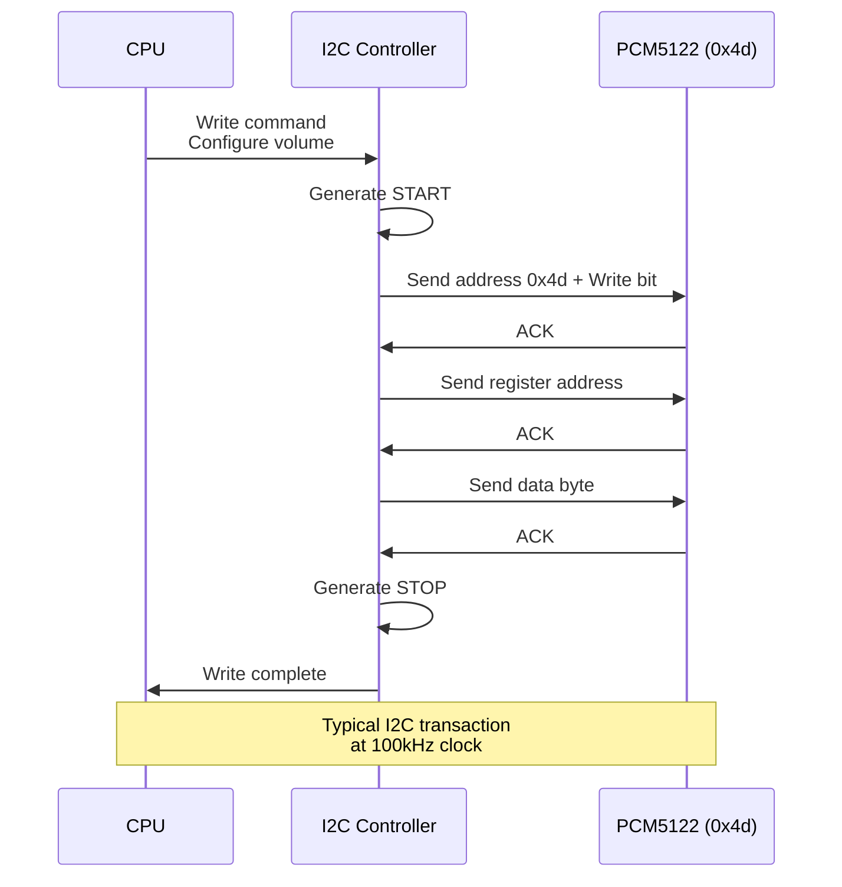
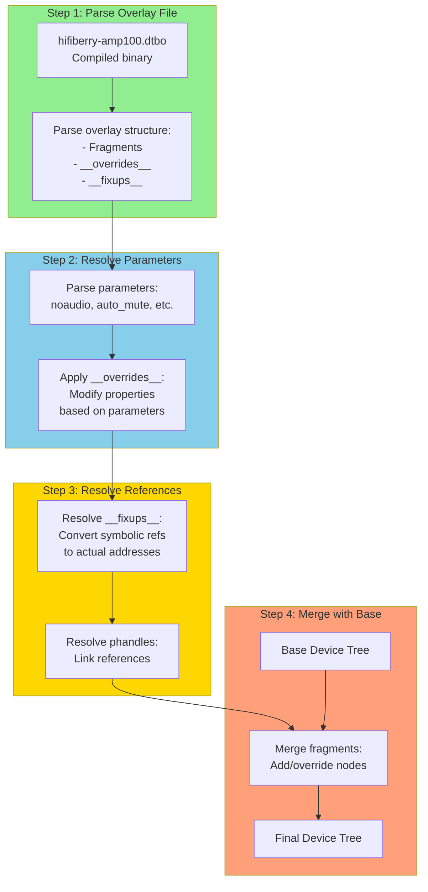

# Device Tree Visual Diagrams

**Date:** 2026-01-18
**Purpose:** Visual representations of device tree concepts, hardware architecture, and system layers

## Table of Contents

1. [Hardware Layer Diagram](#hardware-layer-diagram)
2. [Layer Separation Diagram](#layer-separation-diagram)
3. [Audio Signal Flow](#audio-signal-flow)
4. [Display Signal Flow](#display-signal-flow)
5. [Boot Sequence Diagram](#boot-sequence-diagram)
6. [I2C Bus Architecture](#i2c-bus-architecture)
7. [Device Tree Loading Process](#device-tree-loading-process)
8. [Parameter Resolution Flow](#parameter-resolution-flow)

---

## Hardware Layer Diagram

### Ghettoblaster Complete Hardware Architecture

```mermaid
graph TB
    subgraph pi5 [Raspberry Pi 5 - BCM2712]
        cpu[CPU<br/>Cortex-A76]
        rp1[RP1 Chip<br/>I/O Controller]
        i2c1[I2C Bus 1<br/>GPIO 2/3]
        i2s[I2S Interface<br/>DesignWare I2S]
        hdmi0[HDMI Port 0]
        hdmi1[HDMI Port 1]
        gpio[GPIO Controller]
    end
    
    subgraph audio [Audio Subsystem]
        osc[Clock Oscillator<br/>dacpro_osc]
        pcm[PCM5122 DAC<br/>I2C: 0x4d]
        amp[AMP100 Amplifier<br/>2x 30W Class D]
        spk_l[Speaker L]
        spk_r[Speaker R]
    end
    
    subgraph display [Display Subsystem]
        hdmi_cable[HDMI Cable]
        panel[Waveshare 7.9"<br/>400x1280 Portrait<br/>1280x400 Landscape]
        backlight[LED Backlight]
    end
    
    subgraph touch [Touch Subsystem]
        ft6236[FT6236 Controller<br/>I2C: 0x38]
        touch_panel[Capacitive Touch<br/>1280x400]
        int_gpio[Interrupt GPIO 25]
    end
    
    cpu --> rp1
    rp1 --> i2c1
    rp1 --> i2s
    rp1 --> hdmi0
    rp1 --> hdmi1
    rp1 --> gpio
    
    i2c1 -->|I2C Address 0x4d| pcm
    i2c1 -->|I2C Address 0x38| ft6236
    i2s -->|BCK, LRCK, DATA| pcm
    osc -->|MCLK| pcm
    pcm -->|Analog Audio| amp
    amp --> spk_l
    amp --> spk_r
    
    hdmi0 -->|Video Signal| hdmi_cable
    hdmi_cable --> panel
    panel --> backlight
    
    ft6236 --> touch_panel
    gpio -->|GPIO 25 Falling Edge| ft6236
    
    style pi5 fill:#e1f5e1
    style audio fill:#ffe1e1
    style display fill:#e1e1ff
    style touch fill:#fff5e1
```

### Hardware Components Detail



---

## Layer Separation Diagram

### Complete System Layers



### What Each Layer Controls



---

## Audio Signal Flow

### Complete Audio Chain

```mermaid
graph LR
    subgraph source [Audio Source]
        file[Music File<br/>FLAC/MP3/DSD]
        stream[Network Stream<br/>Spotify/AirPlay]
    end
    
    subgraph mpd_layer [MPD Layer]
        decoder[Decoder<br/>libFLAC, etc.]
        mixer[Software Mixer<br/>Volume Control]
        output[MPD ALSA Output]
    end
    
    subgraph alsa_layer [ALSA Layer]
        pcm[PCM Device<br/>hw:0,0]
        dmix[dmix Plugin<br/>Mixing]
        iec[IEC958 Control<br/>S/PDIF on/off]
        hw[Hardware Device<br/>snd_rpi_hifiberry_dacplus]
    end
    
    subgraph hardware [Hardware Layer]
        i2s_bus[I2S Bus<br/>BCK/LRCK/DATA]
        pcm5122[PCM5122 DAC<br/>32-bit, 384kHz]
        amp100[AMP100 Amp<br/>2x 30W]
        speakers[Speakers]
    end
    
    file --> decoder
    stream --> decoder
    decoder --> mixer
    mixer --> output
    output --> pcm
    pcm --> dmix
    dmix --> iec
    iec --> hw
    hw --> i2s_bus
    i2s_bus --> pcm5122
    pcm5122 --> amp100
    amp100 --> speakers
    
    style source fill:#e1f5e1
    style mpd_layer fill:#ffe1e1
    style alsa_layer fill:#fff5e1
    style hardware fill:#e1e1ff
```



### Device Tree Audio Configuration



---

## Display Signal Flow

### Complete Display Chain

```mermaid
graph TB
    subgraph boot [Boot Stage]
        firmware[Pi Firmware]
        dt_display[Device Tree:<br/>vc4-kms-v3d-pi5]
        cmdline_vid[cmdline.txt:<br/>video=HDMI-A-1:1280x400@60]
        fb[Framebuffer<br/>1280x400 Landscape]
    end
    
    subgraph kernel [Kernel Stage]
        vc4_driver[VC4 KMS Driver]
        hdmi_driver[HDMI Driver]
        drm[DRM Subsystem]
    end
    
    subgraph runtime [Runtime Stage]
        x11_server[X11 Server<br/>:0.0]
        xinitrc[.xinitrc<br/>Reads moOde DB]
        xrandr[xrandr<br/>--rotate left/normal]
        compositor[Window Manager<br/>Openbox]
    end
    
    subgraph application [Application Stage]
        chromium[Chromium<br/>--kiosk mode]
        moode_ui[moOde UI<br/>http://localhost]
        peppy[PeppyMeter<br/>Visualization]
    end
    
    firmware --> dt_display
    dt_display --> vc4_driver
    cmdline_vid --> fb
    vc4_driver --> hdmi_driver
    hdmi_driver --> drm
    drm --> x11_server
    x11_server --> xinitrc
    xinitrc --> xrandr
    xrandr --> compositor
    compositor --> chromium
    chromium --> moode_ui
    chromium --> peppy
    
    style boot fill:#90EE90
    style kernel fill:#87CEEB
    style runtime fill:#FFD700
    style application fill:#FFA07A
```

### Display Orientation Control

```mermaid
graph LR
    subgraph boot_orient [Boot Screen Orientation]
        cmdline_param[cmdline.txt:<br/>video=HDMI-A-1:1280x400@60]
        fb_orient[Framebuffer:<br/>1280x400 Landscape<br/>Physical orientation]
        boot_splash[Boot Splash:<br/>Raspberry Pi logo]
    end
    
    subgraph runtime_orient [Runtime Orientation]
        db[moOde Database:<br/>hdmi_scn_orient]
        xinitrc_read[.xinitrc reads:<br/>hdmi_scn_orient value]
        xrandr_cmd[xrandr command:<br/>--rotate left or normal]
        x11_orient[X11 Display:<br/>Rotated in software]
        app_display[Applications see:<br/>Rotated coordinates]
    end
    
    cmdline_param --> fb_orient
    fb_orient --> boot_splash
    
    db --> xinitrc_read
    xinitrc_read --> xrandr_cmd
    xrandr_cmd --> x11_orient
    x11_orient --> app_display
    
    boot_splash -.->|After boot| x11_orient
    
    style boot_orient fill:#90EE90
    style runtime_orient fill:#FFD700
```

---

## Boot Sequence Diagram

### Complete Boot Process



### Device Tree Loading Detail



---

## I2C Bus Architecture

### I2C Bus 1 Layout



### I2C Communication Flow



---

## Device Tree Loading Process

### Overlay Application Process



### Fragment Application

```mermaid
graph LR
    subgraph fragment [Fragment@2: PCM5122 Config]
        target[target = &i2c1]
        overlay[__overlay__ {<br/>pcm5122@4d {...}<br/>}]
    end
    
    subgraph base [Base Device Tree]
        i2c1_node[i2c@74000 {<br/>compatible = "brcm,bcm2711-i2c"<br/>reg = <0x7e804000 0x1000><br/>}]
    end
    
    subgraph result [Result After Merge]
        i2c1_merged[i2c@74000 {<br/>compatible = "brcm,bcm2711-i2c"<br/>reg = <0x7e804000 0x1000><br/>pcm5122@4d {<br/>  compatible = "ti,pcm5122"<br/>  reg = <0x4d><br/>  ...<br/>}<br/>}]
    end
    
    fragment --> base
    base --> result
    
    style fragment fill:#90EE90
    style base fill:#87CEEB
    style result fill:#FFA07A
```

---

## Parameter Resolution Flow

### How dtoverlay Parameters Work

```mermaid
graph TB
    subgraph config [config.txt]
        line[dtoverlay=hifiberry-amp100,auto_mute]
    end
    
    subgraph parse [Parameter Parsing]
        split[Split: name=hifiberry-amp100<br/>param=auto_mute]
    end
    
    subgraph overlay [Overlay File]
        overrides[__overrides__ {<br/>auto_mute = &lt;&sound&gt;,"hifiberry-dacplus,auto_mute?"<br/>}]
    end
    
    subgraph apply [Parameter Application]
        find[Find target node: &sound]
        add_prop[Add property:<br/>hifiberry-dacplus,auto_mute = true]
    end
    
    subgraph result [Device Tree Result]
        sound_node[sound {<br/>compatible = "hifiberry,hifiberry-dacplus"<br/>hifiberry-dacplus,auto_mute = true<br/>}]
    end
    
    subgraph driver [Driver Behavior]
        read[Driver reads property:<br/>hifiberry-dacplus,auto_mute]
        enable[Enable auto-mute feature:<br/>Mute amp on silence]
    end
    
    config --> parse
    parse --> overlay
    overlay --> apply
    apply --> result
    result --> driver
    
    style config fill:#90EE90
    style parse fill:#87CEEB
    style overlay fill:#FFD700
    style apply fill:#FFA07A
    style result fill:#e1f5e1
    style driver fill:#ffe1e1
```

### Boolean vs Value Parameters

```mermaid
graph LR
    subgraph boolean [Boolean Parameter]
        bool_syntax[auto_mute = &lt;&sound&gt;,"property?"]
        bool_use[Usage: dtoverlay=...,auto_mute]
        bool_result[Result: property exists<br/>Driver checks existence]
    end
    
    subgraph value [Value Parameter]
        val_syntax[mute_ext_ctl = &lt;&sound&gt;,"property:0"]
        val_use[Usage: dtoverlay=...,mute_ext_ctl=4]
        val_result[Result: property = 4<br/>Driver reads value]
    end
    
    bool_syntax --> bool_use
    bool_use --> bool_result
    
    val_syntax --> val_use
    val_use --> val_result
    
    style boolean fill:#90EE90
    style value fill:#87CEEB
```

---

## Summary

These visual diagrams illustrate:

1. **Hardware Architecture** - Complete component layout and connections
2. **Layer Separation** - What each software layer controls
3. **Signal Flows** - Audio and display data paths
4. **Boot Sequence** - How system initializes from power-on
5. **I2C Architecture** - Device addressing and communication
6. **Device Tree Process** - How overlays are loaded and applied
7. **Parameter Resolution** - How dtoverlay parameters work

### Using These Diagrams

- **For understanding** - See how components interact
- **For troubleshooting** - Identify where in the chain problems occur
- **For documentation** - Include in presentations and guides
- **For teaching** - Explain concepts visually

### Diagram Formats

All diagrams are in **Mermaid** format, which renders in:
- GitHub/GitLab markdown
- Many documentation tools
- Can be exported to PNG/SVG

**Status:** Phase 5 Diagrams Complete
